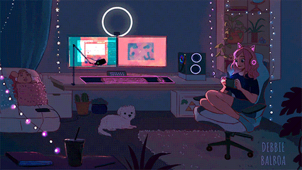

  

── .✦ Bienvenid@ ── ୨ৎ ──

  
<i>

Este es un proyecto web hecho con cariño, utilizando HTML, CSS, JavaScript y PHP. Fue creado para practicar el desarrollo web y explorar la publicación de sitios en GitHub.  
Diseñado con una vibra cálida, organizada y suave. ♡

</i>

---

⋆｡ﾟ☁︎ Tecnologías utilizadas ☁︎｡ﾟ⋆

  
  
  
  

---

✶⋆.˚ Propósito del Proyecto ˚⋆✶

<i>

𓆩✧𓆪 Aplicar los conocimientos adquiridos sobre desarrollo web  
𓆩✧𓆪 Practicar GitHub y GitHub Pages  
𓆩✧𓆪 Crear una base estética y funcional para proyectos futuros

</i>

---

╰┈➤ Estructura del Proyecto

